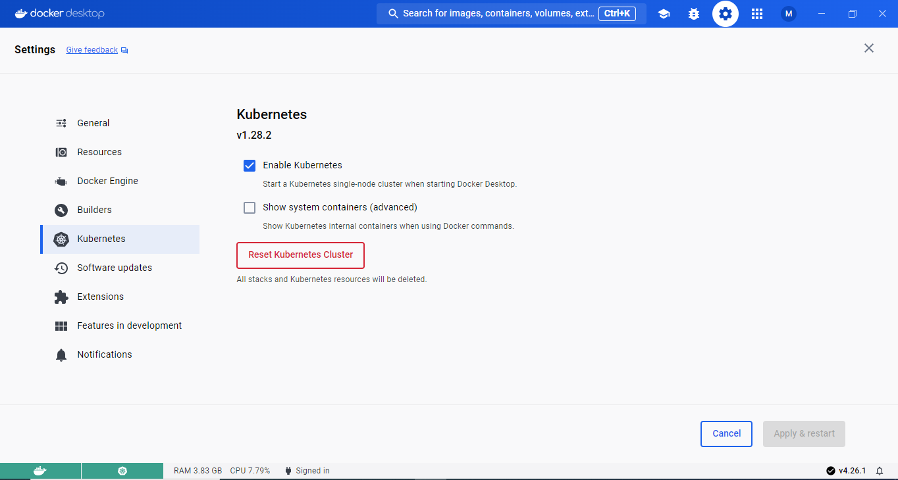
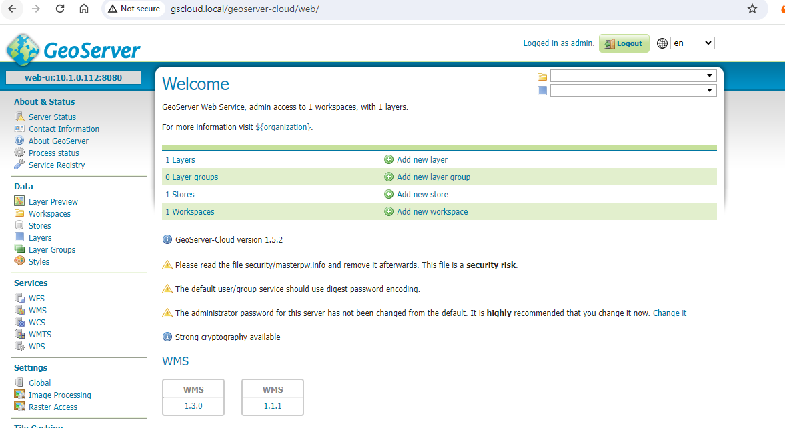

# Docker Desktop (Windows) Example

This example is tested on docker desktop v4.26.1.

## Install [Docker Desktop](https://docs.docker.com/desktop/install/windows-install/)

Once docker desktop is installed, enable kubernetes extension in the settings.Ensure both docker engine & kubernetes are green before proceeding.


## Install kubectl & helm

## Install NGINX ingress controller

```
helm upgrade --install ingress-nginx ingress-nginx \
  --repo https://kubernetes.github.io/ingress-nginx \
  --namespace ingress-nginx --create-namespace
```

## Navigate to docker-desktop/datadir and run helm install

```
 helm upgrade --install --values=.\values.yaml ogsdocker .
```

This will install ingress, postgres & geoserver cloud.
Add gscloud.local to host file, and you should see application running at

http://gscloud.local/geoserver-cloud/web


Note: Due to resource constrain on local machine, other pods except web are disabled with flag. Change flag in values.yaml to enable them.
